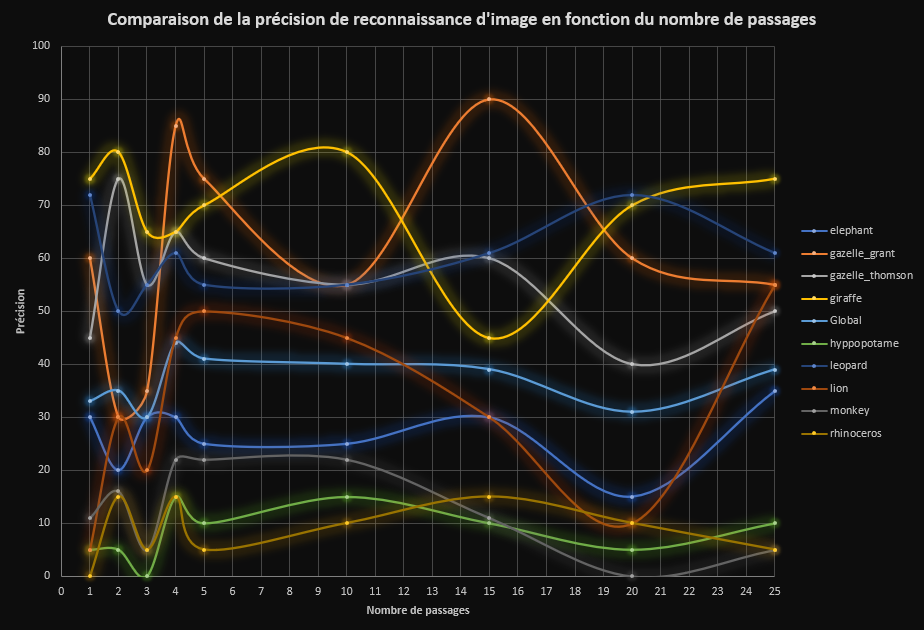
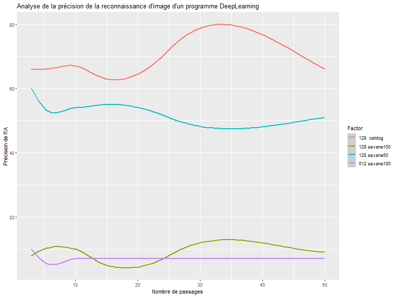

# **Nos Essais**

## *Domaine et catégories*
Le domaine choisi pour la reconnaissance concerne les animaux d'Afrique et les images proviennent des moteur de recherche Google, Qwant, DuckDuckGo, via Mozilla.
Pour réaliser nos essais nous avons utilisé 9 catégories d'images :

* elephant
* gazelle grant
* gazelle thomson
* giraffe
* hyppopotame
* leopard
* lion
* monkey
* rhinoceros

## *Corpus d'apprentissage*
La constitution du corpus d'apprentissage passe par l'acquisition des images des différentes catégories.  
Cependant, lors de celle ci, on remarque que certaines images ne correspondent pas à la catégorie souhaitée. On trouve par exemple des images de motos dans la catégorie singe.  
Il faut donc supprimer les images non voulues manuellement.  
Pour vérifier l'efficacité de notre corpus, on le scinde en deux parties:  
- une partie pour les tests  
- une partie pour l'entrainement  
Pour de faire, on dépose les catégories souhaitées dans le dossier `raw_set` et on le passe ensuite dans le programme `dataset_splitter.py` qui répartira les catégories entre `test_set` et `training_set`.

## *Création du réseau neuronal*

Suite à la création de notre corpus, on crée notre 1er réseau neuronal :
Avec le programme `simple_cnn_menu.py`, on crée un réseau en choisissant :  
- l'emplacement : `dataset`  
- le nombre de passages d'apprentissages  
- un style binaire (s'il n'y a que 2 catégories à tester)  

Une fois la création initiée, le programme va entrainer le modèle selon les spécifications entrées précédemment, sur les images des catégories situées dans le dossier `training_set`.  
Le premier modèle créé se nomme `savane128_5p` (5 passages,réseau dense de 128 neurones, concernant le domaine savane).


## *Test du réseau neuronal*

Suite à la création du réseau neuronal, on souhaite le tester.  
Pour rappel, il est constitué de 128 neurones et de 5 passages sur un total de 9 catégories pour analyser 176 images de test.  
Au départ, nous avons lancé le programme sur les catégories à classer situées dans `test_set` et nous avons observé différents résultats, par image. En général, 2 images sur 5 étaient reconnues comment étant conformes à leur catégorie.

Le premier résultat monte à 41% de précision. Nous avons souhaité comparer avec d'autres modèles :  
- savane128_1p : 33%  
- savane128_2p : 35%  
- savane128_3p : 30%  
- savane128_4p : 44%  
- savane128_5p : 41%  
- savane128_10p : 40%  
- savane128_15p : 39%  
- savane128_20p : 31%  
- savane128_25p : 39%  

Nous observons ainsi que le modèle le plus efficace sur une recherche se basant sur 9 catégories avec 176 images concerne le modèle à 4 passages d'apprentissage.

```{r graph1, echo=FALSE, out.width = '100%', fig.align = "center"}

```

## *Conclusion : * 
  
On observe ainsi que le nombre de passage n'influe pas forcément sur la précision de l'analyse des images.  
En effet, selon la catégorie, la précision varie en fonction du nombre de passages. On observe par exemple, pour la catégorie `giraffe`, une précision de 80% au passage 10 contre une précision de 45% au passage 15. Tandis que la catégorie `gazelle_grant` observe une précision de 55% au passage 10 contre une précision de 90% au passage 15.  
On en déduit donc que la précision n'est pas seulement fonction du nombre de passage mais aussi de l'image, du nombre d'image et des catégories.

En parallele de ce fichier vous trouverez les 27 fichiers de sauvegarde de notre réseau neuronal (1 .json - 1 .categories - 1 .h5 par modèle, pour 9 modèles différents).


# **Etudes de réseaux précédemment créés**

```{r graph2, echo=FALSE, out.width = '100%', fig.align = "center"}

```

On peut voir sur ce graphique que la précision de réconnaissance de l'IA dépend du nombre de passages, du nombre de neurones et du nombre d'images. On remarque que :

* La courbe rouge est constituée de 128 neurones basés sur le corpus catdog composé de 1589 images, en 2 catégories, c'est entre 30 et 40 passages que l'IA reconnait le plus d'images correctement.  

* La courbe bleu est constituée de 128 neurones basés sur le corpus savane composé de 334 images, en 9 catégories, l'IA est la plus précise autour de 15 passages.  

* La courbe verte est constituée de 128 neurones basés sur le corpus savane composé de 693 images, en 9 catégories, l'IA est la plus précise autour de 35 passages.  

* La courbe violette est constituée de 512 neurones basés sur le corpus savane composé de 693 images, en 9 catégories, la précision de l'IA est constante quel que soit le nombre de passages. 

# **Conclusion générale**

Suite aux analyses précédentes, il est compliqué d'émettre une généralité concernant le taux de précision d'un modèle.  
En effet, la précision de l'analyse du modèle varie selon :  
 - la taille des catégories à analyser  
 - le nombre de catégories à analyser  
 - le nombre de passages 
 - le nombre d'image utilisées pour l'entrainement du modèle  
 - la densité neuronale du modèle  

# **Remarques sur cette séquence et sur son apport**

Ce cours est intéressant cependant la vitesse des explications à certains moments a entrainé beaucoup de confusion. Le contexte actuel a également eu un impact sur le confort de compréhension vu que nous sommes chacun chez nous avec des PC différents ce qui entraine un ralentissement des cours vu qu'il faut résoudre tous les problèmes un par un, au cas par cas.


